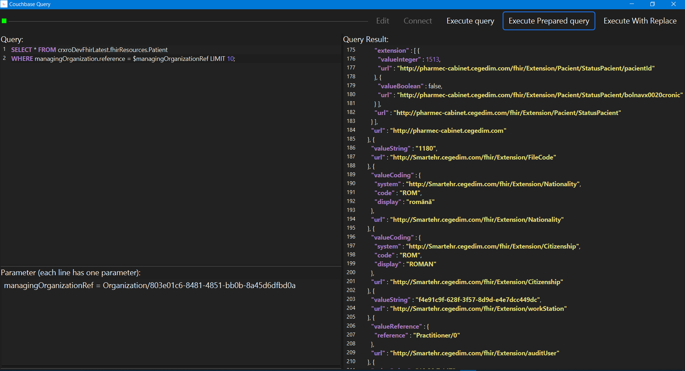

# cb-query
A small application to query data from Couchbase

## Images


## usage
create file src.properties (that contains connection properties) beside the jar or inside root directory

file has to be similar to this:

connection=couchbase://localhost

user=username

pass=password

bucket=bucketName

scope=_default


then run the application

```
java -jar cb-query-0.0.1-SNAPSHOT.jar
```

and then click 'Connect' and if successful add a query to fetch data from couchbase


## Attributions
<a href="https://www.freepik.com/free-vector/branding-identity-corporate-vector-logo-design_22116270.htm#query=logo&position=5&from_view=keyword&track=sph&uuid=115a6eec-82f2-4fe7-bc12-3c8bb4b7e6e9">Image by Rochak Shukla</a> on Freepik
